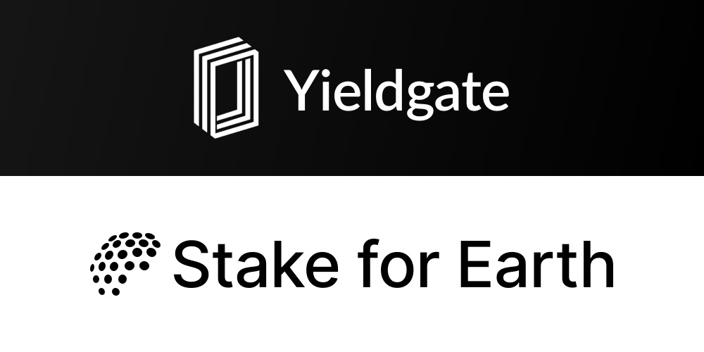

# Yieldgate 🤝 Stake for Earth

[](https://yieldgate.mit-license.org/)
[](https://codecov.io/gh/yieldgate/yieldgate)

This repository serves as a codebase for two overlapping projects:

- **Yieldgate** ([yieldgate.xyz](https://yieldgate.xyz)) is a protocol that allows anyone to start earning and building products with programmable yield. It originated as a finalist hackathon project at ETHGlobal in Amsterdam.
- **Stake for Earth** ([stakefor.earth](https://stakefor.earth)) is a pool which generates compounding yield to enable climate action at 0 cost.

This project is backed by Aave, Toucan, The Graph, Polygon, Coinbase, and WalletConnect. ❤️



---

## The Stack

- Package-Manager: `pnpm`
- Monorepo Tooling: `turborepo`
- Smart Contract Development: `hardhat`
  - Deploy & Address-Export: `hardhat-deploy`
  - Typescript-Types: `typechain`
- Frontend: `next`
  - Contract Interactions: `wagmi`, `rainbowkit`
  - Styling: `tailwindcss`, `chakra-ui`
  - Styled Components: `twin.macro`, `emotion`
- Misc:
  - Linting & Formatting: `eslint`, `prettier`
  - Actions on Git Hooks: `husky`, `lint-staged`

See [ETHathon](https://github.com/ethathon/ethathon) for a equally set-up dApp-development boilerplate.

## Getting Started

```bash
# Install (or update) pnpm
npm i -g pnpm

# Install project dependencies
pnpm install

# Copy & fill environments
cp packages/frontend-sfe/.env.local.example packages/frontend-sfe/.env.local && nano packages/frontend-sfe/.env.local
cp packages/frontend-yg/.env.local.example packages/frontend-yg/.env.local && nano packages/frontend-yg/.env.local
cp packages/contracts/.env.example packages/contracts/.env && nano packages/contracts/.env
```

## Development

When working in VSCode, it's recommended doing so by opening the workspace file located at `.vscode/yieldgate.code-workspace` and installing recommended plugins listed in `.vscode/extensions.json`.

```bash
# Generate types, artifacts & start both frontends
pnpm run dev

# Generate types, artifacts & start frontend (Yieldgate-only)
pnpm run dev-yg

# … or only start frontend if types are generated previously (Yieldgate-only)
pnpm run dev:frontend-yg

# Start local hardhat network & deploy contracts
pnpm run deploy:contracts
```
